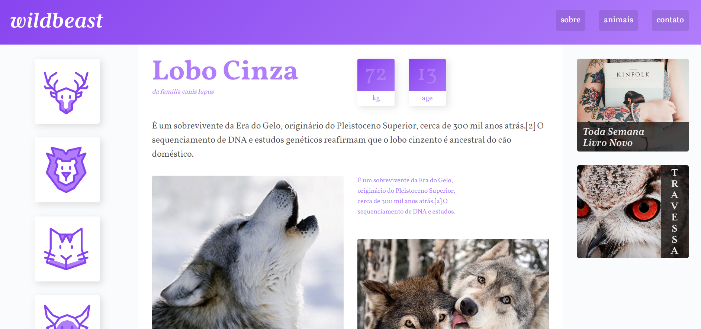

# Wildbeast - aprimorando o CSS Grid Layout.

  

# 🎇 Tecnologias

Esse projeto foi desenvolvido com as seguintes tecnologias:

- HTML 5
- CSS 3 (Utilizando o Grid Layout)

# 🎆 Sites utilizado para o desenvolvimento

- [Wildbeast Guia Completo](https://www.origamid.com/curso/css-grid-layout/) - O CSS Grid Layout Guia Completo é um guia desenvolvido pelo André Rafael da Origamid
- [MDN - CSS](https://developer.mozilla.org/pt-BR/docs/Web/CSS) - O MDN Web Docs é o website oficial de Mozilla para desenvolvimento de padrões web.

# 🎯 Acesse ao projeto

Você pode acessar o site pelo link abaixo:

- [Wildbeast](https://flexblog-lucas-css.netlify.app/) - O site está hospedado gratuitamente na Netlify

# 💼 Direitos

- Todos os direitos reservados por André Rafael - [Origamid](https://www.origamid.com/)  
- Feito por Lucas Cano.
